# Tacklebox side-by-side comparison

iOS is the visual lead. These are actual dedicated QA captures, not mockups. The apps share the Heritage palette and bundled Spectral/Figtree fonts. Native navigation, pickers and sharing still follow each platform.

See the review report for coverage and release prerequisites.

## Unlimited

Two free sessions, then one purchase. Existing journal access remains available. Native sheet and card controls differ; wording and brand match.

| iOS · lead | Android |
|---|---|
| 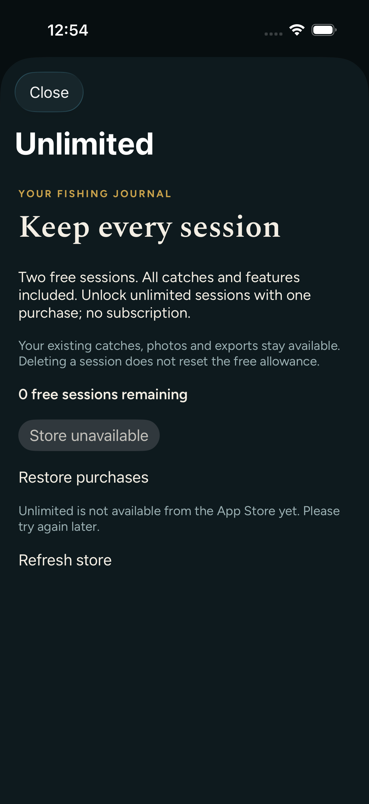 | 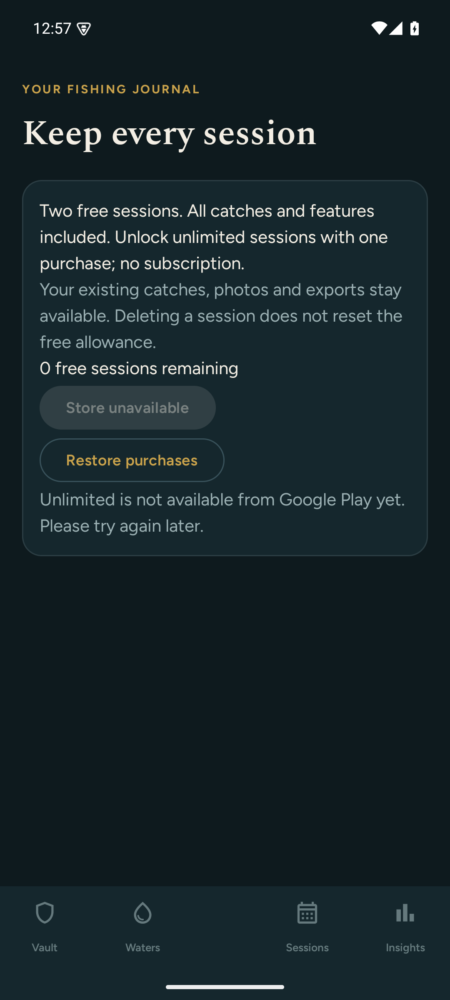 |

## Trip planner

Seven prospective dates, forecasts and bite windows. These test devices used different locations and units, so weather values should differ.

| iOS · lead | Android |
|---|---|
| 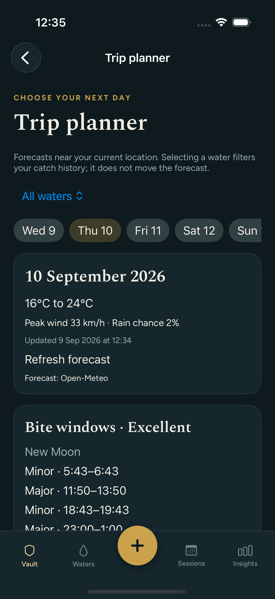 | 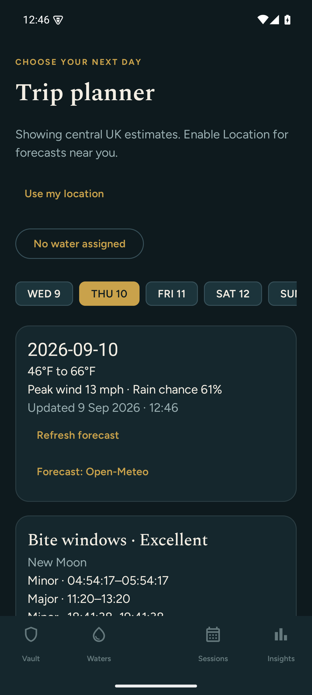 |

## Photo backup

The same portable format, privacy explanation and create/restore actions. Native navigation headers differ.

| iOS · lead | Android |
|---|---|
| 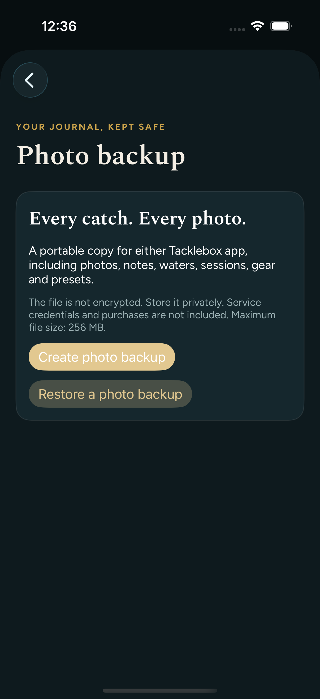 | 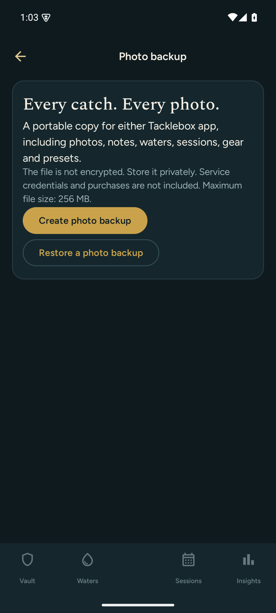 |

## Season Book selection

Year, catch selection and independent photo/note controls. Test catches differ between devices.

| iOS · lead | Android |
|---|---|
| 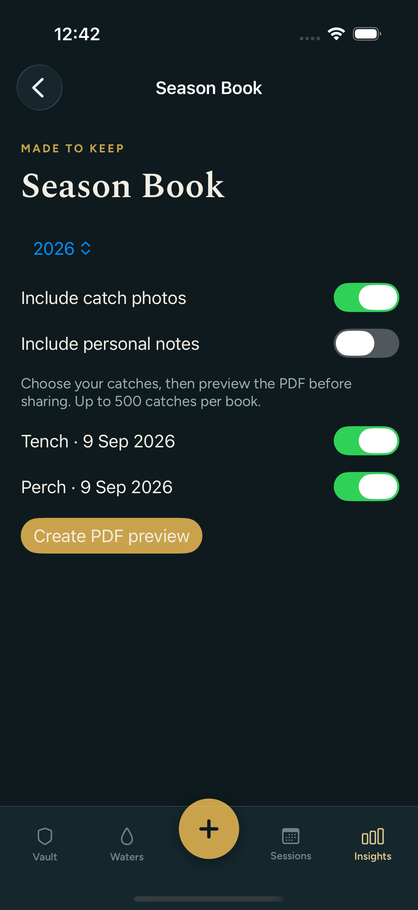 | 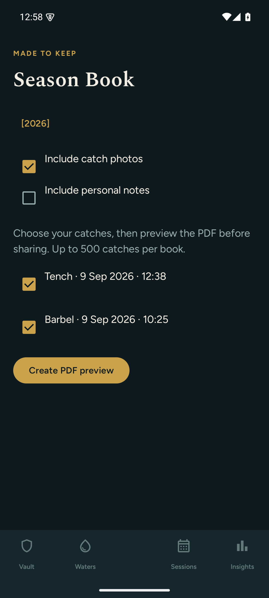 |

## PDF preview

Both native previews reach the system share sheet. iOS scrolls through pages; Android uses Previous/Next.

| iOS · lead | Android |
|---|---|
| 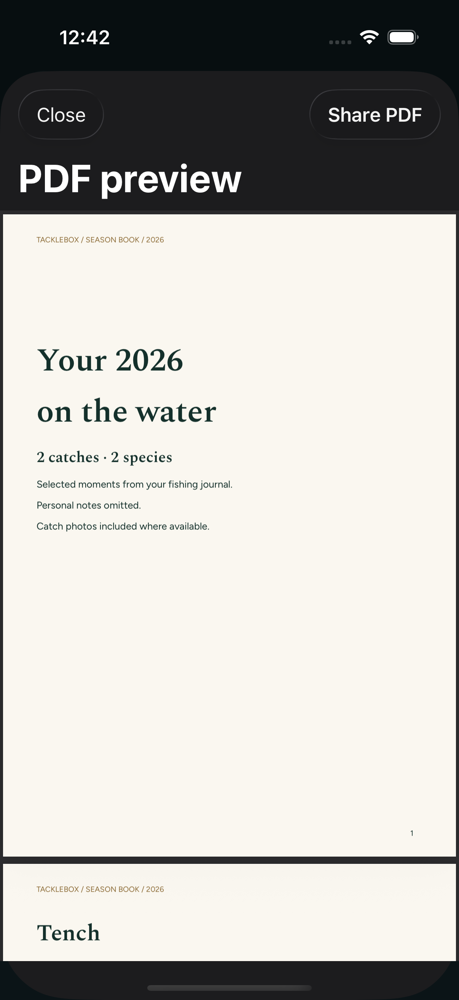 | 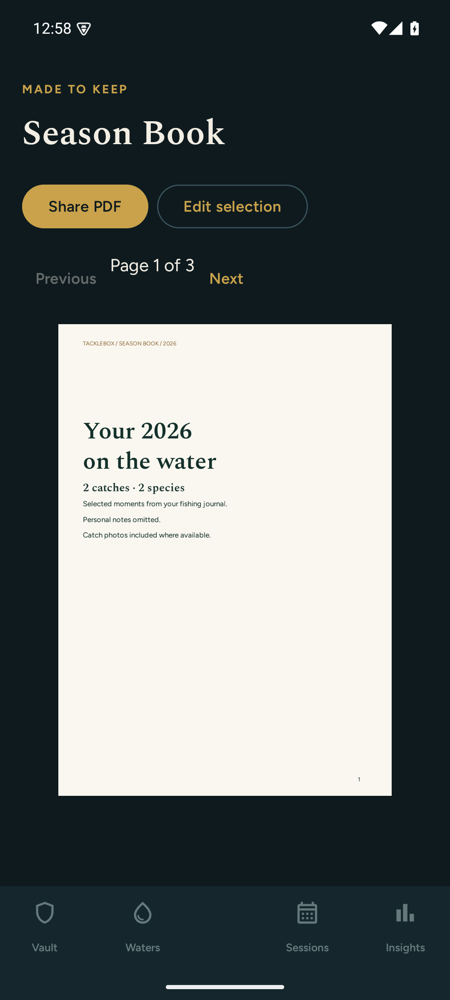 |

## Exported cover

Matched A4 layout, Spectral and Figtree fonts, ink, paper colour and line spacing. Both long test books contain six pages.

| iOS · lead | Android |
|---|---|
| 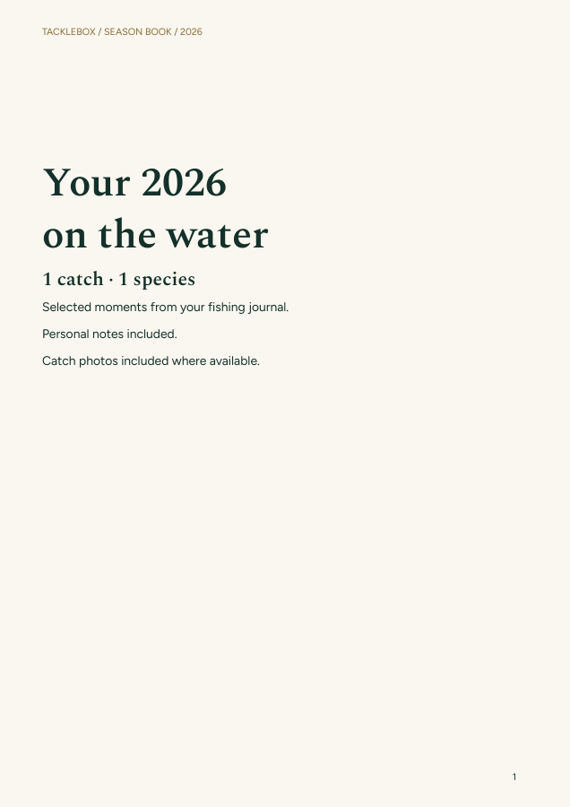 | 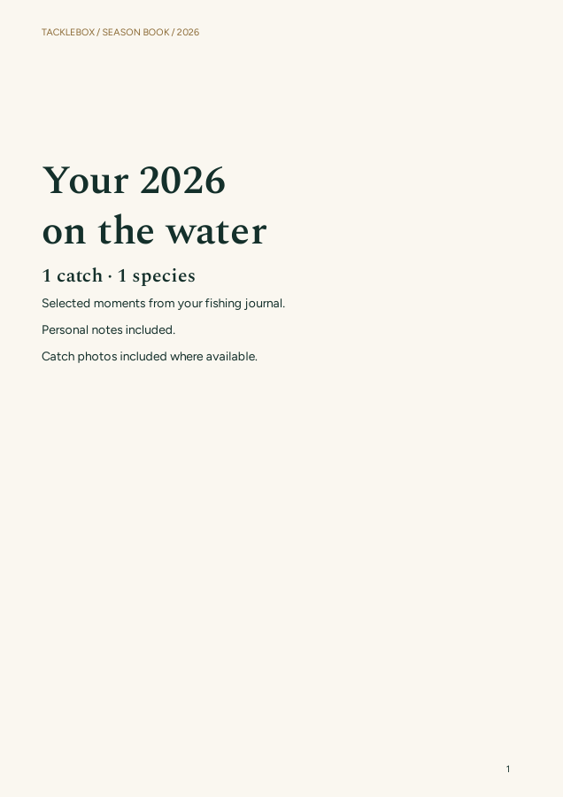 |

## Exported catch page

Matching catch details, photo placement and notes. The deliberately synthetic source photos have different colours.

| iOS · lead | Android |
|---|---|
| 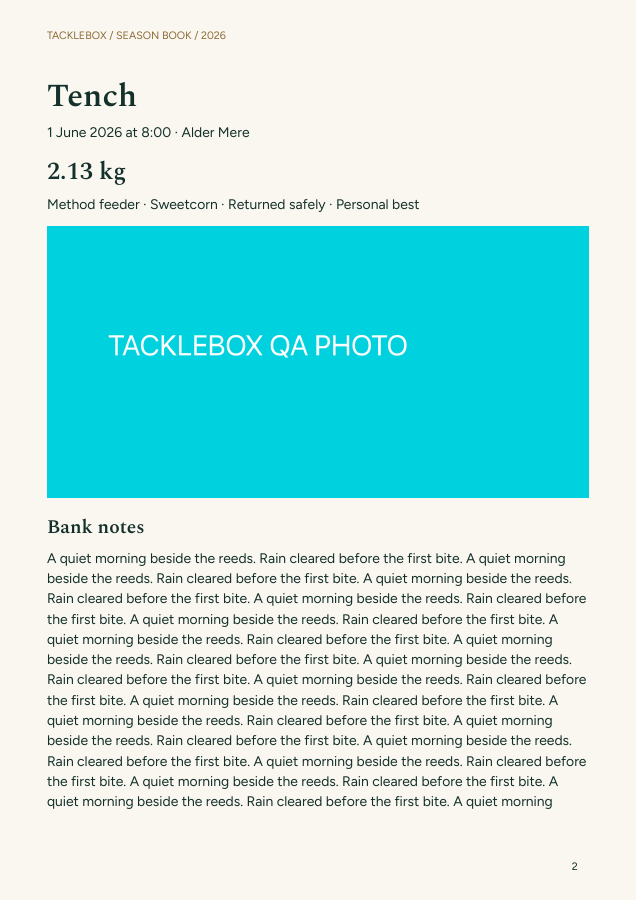 | 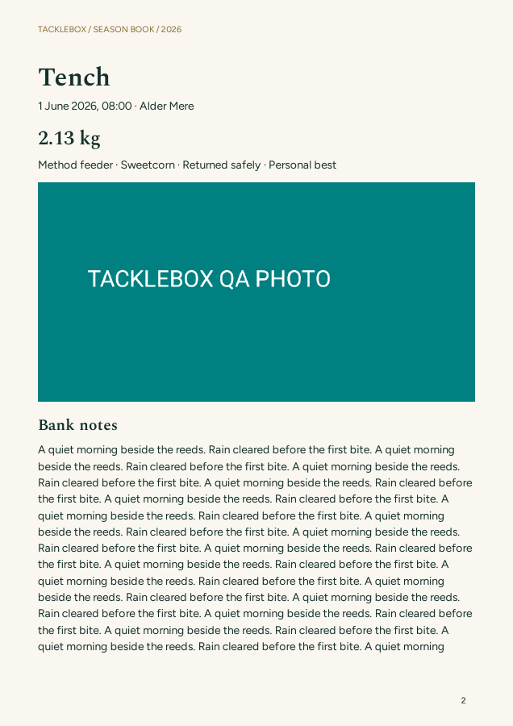 |

## Session detail

Saved notes and catch timelines are available on both. Android now has a date, water and notes editor. The test sessions contain different records.

| iOS · lead | Android |
|---|---|
| 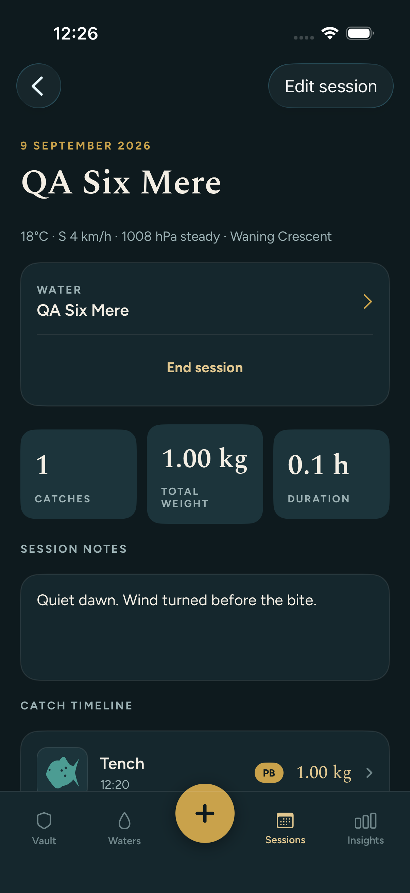 | 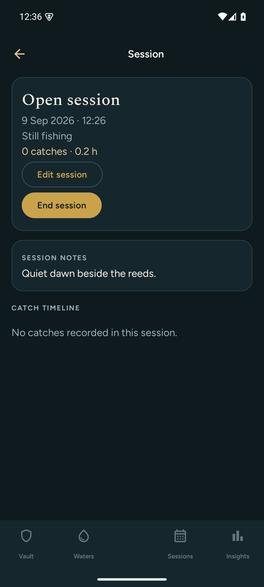 |

## Live session

Actual iOS Dynamic Island and Android ongoing notification. These use each operating system’s presentation; neither exposes water names or catch photos.

| iOS · lead | Android |
|---|---|
| 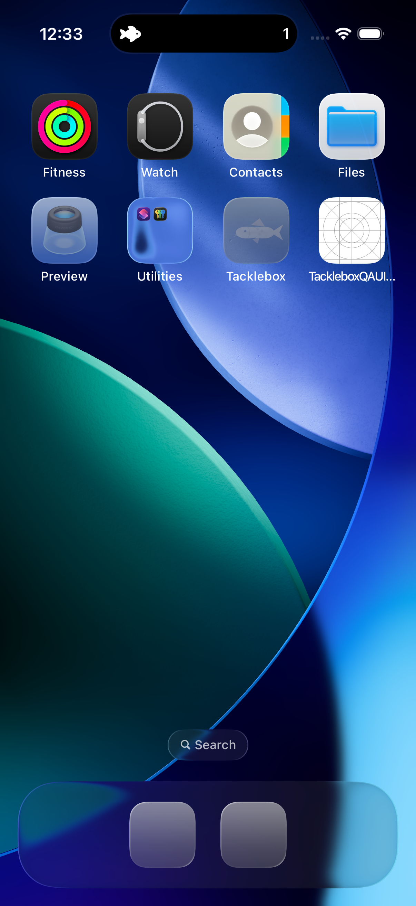 | 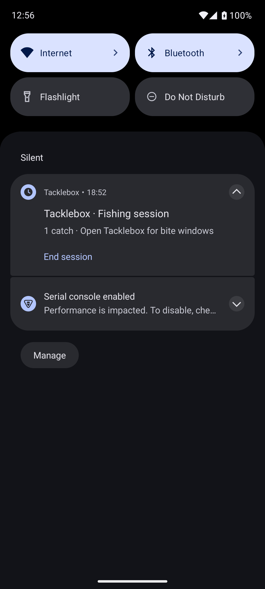 |